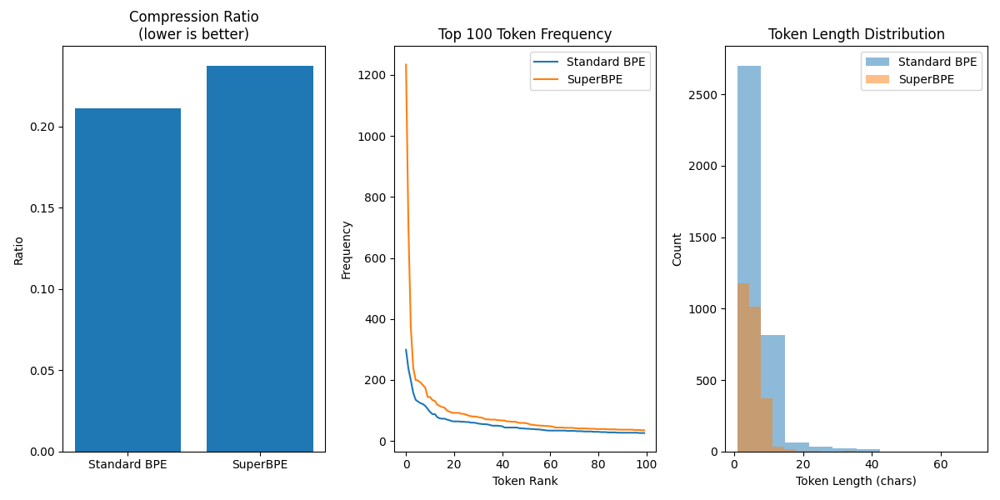

# SuperBPE: Space Travel for Language Models in Rust
Unofficial implementation of [SuperBPE: Space Travel for Language Models](https://arxiv.org/abs/2503.13423) in Rust.
Just for fun and there may be mistakes. Use with caution.

The official implementation is out [here](https://github.com/PythonNut/superbpe). 
I need to compare with their official implementation. 

## System info
- OS: MacOS Sequoia 15.3.2
- Chip: Apple M2 Max

## Installation

1. To install Rust: `curl --proto '=https' --tlsv1.2 -sSf https://sh.rustup.rs | sh -s -- --default-toolchain=1.79.0 -y`

2. Open a new terminal to set PATH for Rust installation.

3. After opening a new terminal, check the Rust installation by running `rustc --version`.

4. `conda create -n bpe python=3.10`

5. `conda activate bpe`

6. `git clone https://github.com/willxxy/superbpe.git`

6. `pip install -r requirements.txt`

7. `cd bpe` 

8. `maturin develop --release`

## Usage

1. `python main.py`

## Results

For now, here are some results on a smaller dataset (Pride and Prejudice) with 400,000 characters.

BPE Training time: **24.97 seconds**
SuperBPE Training time: **8261.13 seconds**

Final vocab size is determined as ≈ 256 + successful_merges.
These results are with 5000 merges.
We make the transition point at 3000 merges.

## Analysis

1. Training is quite slow...which is expected.
2. Compression rate is worse than BPE? This is just a simple inversion of their byte per token ratio.
3. Looking at the tokenization visualization, it seems like SuperBPE is merging okay (look at the word "sentence")?

However, the Figure 1 in the original paper looks like this:

SuperBPE does not show great benefits until a certain vocab size (~25k).
Also the training is super slow...Maybe I am too impatient XD.
Maybe need to do more analysis and check for bugs.
Also may need to train on a larger dataset.
Feel free to contribute!
